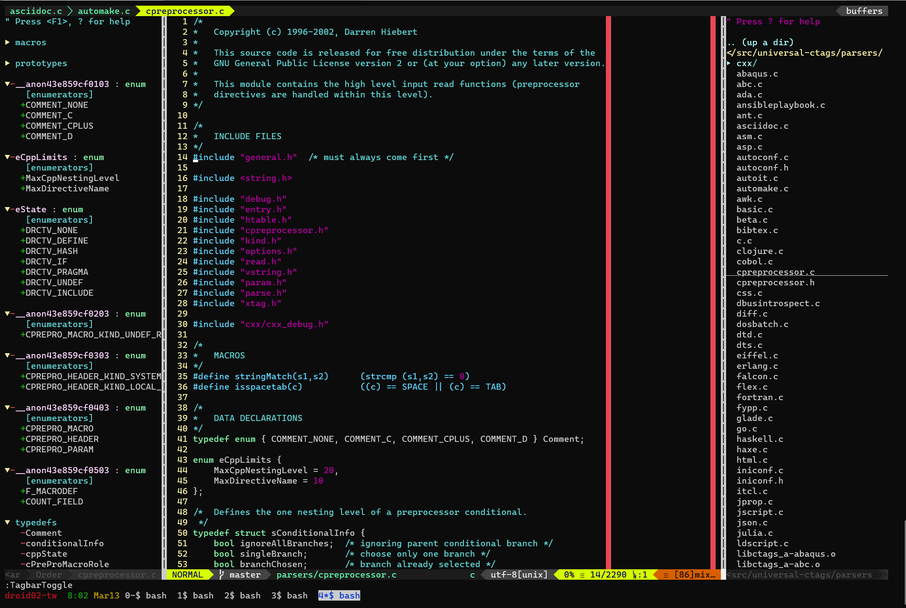

# VIM Studio



## Feature

* File system explorer, browsing directory hierarchies, and performing file system operations

* Source code browser, providing an overview of the structure of the source code

* Statusbar at the bottom, displaying useful information

* Source tab, displaying all opened source via tab interface

  

* Git wrapper, working with Git without leaving Vim studio.

* Marker, highlighting several words in different colors simultaneously

  

* Auto completion, opening popup menu for completion

  

* For more features, see [.vimrc](./.vimrc)

## Installation

1. Setting terminal

   Set `export TERM=xterm-256color` in .bashrc

2. Setting Vim config

   ```bash
   git clone --depth 1 https://github.com/guru245/vim-studio.git [vim-studio where you want]
   ln -s [vim-studio]/.vim ~/.vim
   ln -s [vim-studio]/.vimrc ~/.vimrc
   git clone https://github.com/VundleVim/Vundle.vim.git ~/.vim/bundle/Vundle.vim
   vim +PluginInstall +qall
   ```

   Although you encounter the following error message, continue without any bother. The error won't happen once Vim is set correctly.

   ```bash
   Error detected while processing /home/guru245/.vimrc: line  275:
   E185: Cannot find color scheme 'solarized'
   Press ENTER or type command to continue
   ```

## Usage


